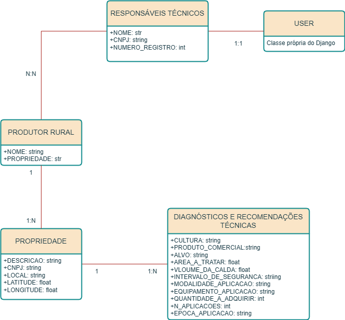

# Projeto AGROSYS
Projeto com intuito de um teste para uma vaga de estágio na empresa Interface Comunicação e Sistema na vaga desenvolvimento em Python + Django

### Introdução ao Projeto
A Empresa AGROSYS está implementando um novo sistema para impressão de seus documentos. Os dados para estas impressões são dados a seguir:

1. RESPONSÁVEIS TÉCNICOS:
    * NOME, CNPJ E NUMERO_REGISTRO
2. PRODUTOR RURAL:
    * NOME, PROPRIEDADE
3. PROPRIEDADE:
    * DESCRICAO, CNPJ, LOCAL, LATITUDE E LONGITUDE
4. DIAGNÓSTICOS E RECOMENDAÇÕES TÉCNICAS:
    * CULTURA, PRODUTO_COMERCIAL, ALVO, AREA_A_TRATAR, VLOUME_DA_CALDA, INTERVALO_DE_SEGURANCA, MODALIDADE_APLICACAO, EQUIPAMENTO_APLICACAO, QUANTIDADE_A_ADQUIRIR, N_APLICACOES, EPOCA_APLICACAO

### Recomendações do Projeto
Os demais campos na impressão podem ser fixados conforme o modelo enviado, mantendo a formatação. 

Aplique o tema JAZZMIN no seu projeto (admin), monte os relacionamentos entre os modelos, monte uma tela para visualizar o documento(detailView) antes de imprimir. Ao clicar no botão imprimir mostre uma div(com jquery) perguntando se que imprimir as PRECAUÇÕES DE USO, caso não IMPRIMA o modelo sem este seção.

### Linguagens do projeto:
* HTML
* CSS
* JavaScript(Jquery)
* Bootstrap
* Django 4.2
* SqLite

### Diagrama Entidade Relacionamento - DER
Diagrama Entidade Relacionamento de acordo com que o projeto podia ser solicitado.


### Instruções para Instalação
A seguir no próximos passo será feito as instruções de como instalar e testar a aplicação.

Passo 1: Por meio do arquivo **requirements.txt** instalar todas as bibliotecas necessárias para o funcionamento do projeto no seu ambiente virtual do Python usando o seguinte comando:
```
pip install -r requirements.txt 
```

Passo 2: Após instalar todas as bibliotecas necessárias para o funcionamento do projeto use o seguinte comando para verificar e debuga o algoritmo.
```
python manage.py migrate
```

Passo 3: Após verificar e debuga o algoritmo use o seguinte comando para criar, atulizar as tabelas
```
python manage.py makemigrations
```

Passo 4: Último passo coloque o comando a seguir para rodar/iniciar o projeto que será disponibilizado no seguinte IP:**http://127.0.0.1:8000/**
```
 python manage.py runserver
```

 Contribuidor principal: https://github.com/FernandoCVieira